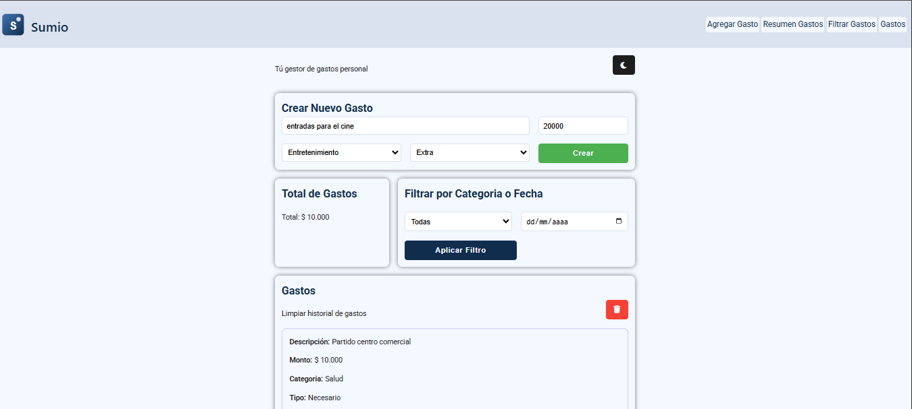

# 🧮 Sumio – Gestor de gastos personales

> Tu rastreador de gastos simple, visual y práctico.

---

## 🚀 ¿Qué es Sumio?

Sumio es una aplicación web para **gestionar tus gastos personales** de forma clara y visual. Pensada para usuarios que quieren llevar control sin complicaciones, directamente desde el navegador.

---

## ✨ Funcionalidades principales

- ➕ Agregar gastos con descripción, monto y categoría
- 🔁 Editar gastos (excepto la fecha)
- ❌ Eliminar gastos
- ✅ Marcar como "necesario" o "extra"
- 🔍 Filtrar por categoría o fecha
- 💰 Ver total general, por categoría o fecha
- 💾 Guardar datos en `localStorage` para persistencia

---

## 🖥️ Demo




---

## 🌐 Despliegue

Este proyecto está disponible públicamente en las siguientes plataformas:

- 🔗 [Versión en Netlify](https://summio-app.netlify.app/)
- 🔗 [Versión en Vercel](https://sumio.vercel.app/)

Ambas versiones se actualizan automáticamente con cada cambio en la rama `main` del repositorio.


---

## 🛠️ Tecnologías usadas

- HTML5 + CSS3 (Mobile-first, modo oscuro, animaciones)
- JavaScript modular (ES Modules)
- `localStorage` para persistencia
- Flexbox + Grid para diseño responsivo

---

## 📦 Estructura del proyecto

```plaintext
📁 src/
├── main.js              # Conecta HTML y JS, define eventos globales
├── ui.js                # Renderiza lista, muestra mensajes, limpia inputs
├── storage.js           # Guarda y recupera datos del localStorage
├── formValidation.js    # Validaciones de campos
└── utils.js             # Funciones puras: ID, fecha, botones, etc.
```

---

## 📚 Validaciones

- Descripción: no vacía, sin símbolos, mínimo 2 letras
- Monto: número positivo, no NaN
- Categoría: debe ser válida
- Tipo: "necesario" o "extra", no por defecto

---

## 📐 Principios de arquitectura

- Separación por módulos
- Funciones puras reutilizables
- Evita duplicación (DRY)
- Accesibilidad: aria-label, data-name en botones
- Precisión en fechas: filtrado local sin desfases de zona horaria

---

## 🛠️ Instalación

```bash
# Clona el repositorio
git clone https://github.com/andresmo23/sumio.git

# Entra al directorio
cd sumio

# Abre el archivo index.html en tu navegador
```

---

## 📈 Roadmap

- [ ] Agregar exportación de gastos a CSV
- [ ] Implementar gráficos con Chart.js
- [ ] Añadir autenticación para múltiples usuarios

---

## 🤝 Contribuciones

Este proyecto está abierto a mejoras. Si deseas contribuir:

1. Haz un fork
2. Crea una rama (`git checkout -b feature/nueva-funcionalidad`)
3. Haz tus cambios
4. Abre un Pull Request

Por favor sigue el estilo modular y documenta tus funciones.

---

## 📄 Licencia

Este proyecto está bajo la licencia MIT. Puedes usarlo libremente con atribución.


---

## 🙌 Autor
Desarrollado por Gonzalo Montoya si te gustó, ¡dale una estrella ⭐ en GitHub!
